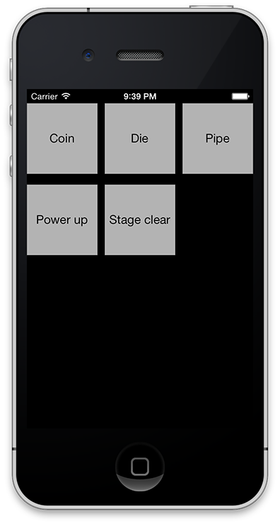

# Soundboard

Quick and dirty soundboard application for iOS. Simply place `.wav`, `.mp3`, or `.aif` files in your application bundle and Soundboard will find them and populate a create a grid with buttons that can be used to play them. 

[BRYSoundEffectPlayer](https://github.com/irace/BRYSoundEffectPlayer) is used to actually play the individual sounds.

## License

Available for use under the MIT license: [http://bryan.mit-license.org](http://bryan.mit-license.org)
